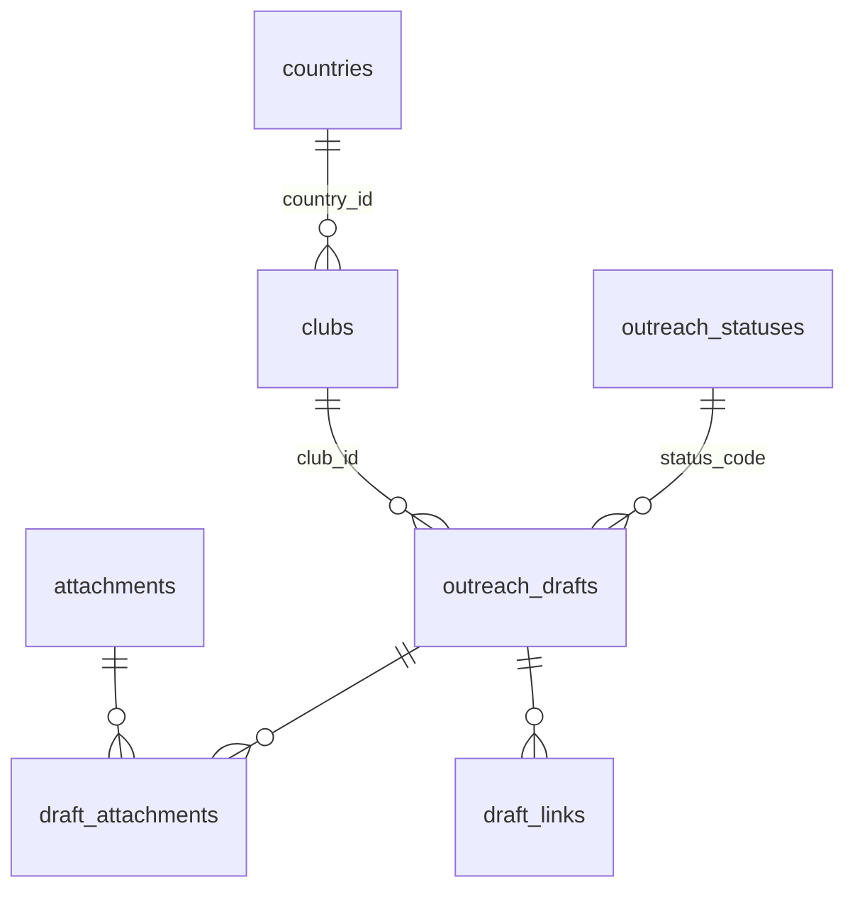

# 🏗️ Architecture — Gwadar Gymkhana Reciprocal Outreach Review

[← Back to project overview](./README.md)

## A static SPA that talks straight to Supabase

```
┌──────────────────────────────────────────────┐
│  Browser (static SPA — Nuxt / Vue / TS)      │
│                                              │
│  app.vue ── LockScreen · DraftCard · WorldMap│
│      │                                       │
│      └── composables                         │
│           useSupabase  (shared client)       │
│           useOutreach  (data + workflow)     │
│           useToast · useClipboard            │
└───────────────┬──────────────────────────────┘
                │  supabase-js (publishable key + user session)
                ▼
┌──────────────────────────────────────────────┐
│  Supabase                                    │
│   • Auth — email + password                  │
│   • PostgREST data API                       │
│   • PostgreSQL 17                            │
│       anon          = no access              │
│       authenticated = read all,              │
│                       update status/sent_at  │
│       service_role  = daily import           │
└──────────────────────────────────────────────┘
                ▲
                │  inserts 10 new drafts a day
┌───────────────┴──────────────────────────────┐
│  Scheduled Claude task (daily import)        │
└──────────────────────────────────────────────┘
```

Nuxt runs with `ssr: false`, so the build is a set of static files that can be hosted anywhere. There are no Nitro server routes and no custom API. The app uses the API that Supabase generates from the database schema.

## Code organisation

- **`app.vue`** — the page shell: header, stat cards, filters, refresh, the draft list, toasts, and the sign-in gate.
- **Components** — `LockScreen` (sign-in), `DraftCard` (one club's email with copy buttons and status actions), `WorldMap` (country shading and markers), and a small copy icon.
- **Composables** — `useSupabase` creates one shared client; `useOutreach` handles loading, paging, counts, status changes, and map data; `useToast` and `useClipboard` are small helpers.
- **State** — shared with Nuxt `useState`. No store library is needed for an app this size.

## Two write paths, kept apart

| Who | Role | What it can write |
| --- | --- | --- |
| **The dashboard** | `authenticated` | Only `status_code` and `sent_at` on `outreach_drafts` |
| **The daily import** | `service_role` | Clubs, drafts, attachment reminders, and links |

The dashboard limit is a **column-level grant** — `GRANT UPDATE (status_code, sent_at)`. This is the strongest boundary: to widen it, someone would have to add a new grant on purpose, not just edit a policy.

## Database schema

Seven tables: two lookup tables, two main business tables, one attachment list, and two link tables.



| Table | Role |
| --- | --- |
| `outreach_statuses` | The four workflow states: `pending`, `approved`, `sent`, `rejected`. |
| `countries` | Countries clubs are in, plus how the map finds each one (path id or marker position). |
| `attachments` | Reminder labels shown on a draft. No file is ever stored. |
| `clubs` | The master list: one row per club, ever — so no club is contacted twice. |
| `outreach_drafts` | One email for one club on one day. This is the row the dashboard updates. |
| `draft_attachments` | Which reminders appear on which draft. |
| `draft_links` | Links mentioned inside a draft's email body. |

The schema uses CHECK constraints to keep data clean (lower-case emails, slug format, `sent_at` only when status is `sent`, every country placeable on the map) and an `updated_at` trigger.

## Loading data

- **Nested selects** — one PostgREST request loads a page of drafts together with each draft's club, country, attachments, and links.
- **Server paging + infinite scroll** — an `IntersectionObserver` at the end of the list loads the next page.
- **Count-only queries** — the stat cards ask the database for exact counts without loading rows.

## Why no server?

This is a small internal tool for a few staff members. Without a server there is nothing to patch, scale, or keep running — just static files and a managed database. The trade-off is that the database must enforce every rule itself, which is exactly what Row Level Security and column-level grants are designed for.

---
<sub>Part of the [Gwadar Gymkhana — Reciprocal Outreach Review](./README.md) case study.</sub>
